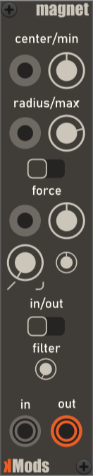
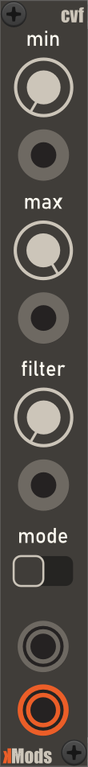

# kMods user guide

## Table of Contents

1.  [Modules](#modules)
    1. [Magnet](#magnet)
    2. [CVF](#cvf)
2.  [Change History](#change-history)

## Modules

### Magnet

#### Description

Magnet is a utility module for pushing and pulling control voltages (CV) inside or outside the specified range.

A standard use case is to use Magnet to ensure that incoming CVs do not occupy a certain CV range, leaving room for other voltages. Conversely, you might want to ensure that CVs exist within a certain range.

#### Parameters

-  **Center / Min**: Depending on the selected mode, this parameter specifies either the center point (= CV) or the minimum CV for the voltage range.

-  **Center / Min (Input socket)**  A monophonic input socket that can be used for controlling **Center / Min** parameter. When used, the parameter from the knob is ignored. The parameter's value range is -10 to 10V. Values outside this range is clamped.

-  **Radius / Max**: Depending on the selected mode, this specifies either the radius around the center or the maximum voltage for the voltage range.

-  **Radius / Max (Input socket)** A monophonic input socket that can be used for controlling **Radius / Max** parameter. When used, the value from the knob is ignored. When using the **Center / Radius** input mode, the parameter's value range is 0 to 10V. When using the **Min / Max** input mode, the value range is -10 to 10V. Values outside these ranges are clamped.

-  **Input mode**: Specifies how the two above parameters are treated. The left position indicates that the range is specified using the center voltage and radius around it. The right position specifies that the above controls are treated as minimum and maximum voltages.

-  **Force**: This parameter specifies how much voltages are pushed away (positive force) or pulled towards (negative force). The direction of the force is specified via the **In / Out** parameter.

-  **Force (Input socket)** A monophonic input socket can be used for controlling **Force** parameter. When used, the value from the knob is ignored. The parameter's value range is -1 to +1V. Values outside this range is clamped.

-  **Force curve type**: This parameter specifies the type of curve used to apply the force. At its leftmost position (0V), a linear curve is used. At its rightmost position (+1V), an exponential curve is used.

-  **Curve strength**: This parameter is used only when the **Force Curve Type** is greater than 0V. It can be used to fine-tune the strength applied when using an exponential curve.

-  **In / Out**: This parameter specifies the targets for the force:
   -  **In (Inside)**: This mode specifies that a negative force will pull voltages towards the center point of the specified voltage range; a positive force pushes voltages towards the borders of the specified voltage range.
   -  **Out (Outside)**: This mode specifies that a negative force pulls voltages towards the borders of the specified voltage range; a positive force pushes voltages towards the -10/10V limits.

-  **Filter**: This parameter can be used to remove voltages that are within the specified range.

-  **In**: Polyphonic input socket for the voltages to be modified.

-  **Out**: Polyphonic output socket that returns the result of the module.

#### Context Menu

Not used, besides standard items.

### CVF

#### Description

CVF, or Control Voltage Filter, is a utility module for filtering incoming CV's based on a specified CV: values that are inside/outside specified range, will be removed.

Standard use case is to specify a CV range using **Min** and **Max** values, and then use the **Filter** parameter to remove some, or all, CV's from that range.

#### Parameters

-  **Min**: Minimum voltage. Parameter for selecting the processed voltages when **Mode** is either **Inside** or **Outside**.

-  **Min (Input socket)**  A monophonic input socket that can be used for controlling **Min** parameter. When used, the parameter from the knob is ignored. The parameter's value range is -10 to 10V. Values outside this range is clamped.

-  **Max**: Maximum voltage. Parameter for selecting the processed voltages when **Mode** is either **Inside** or **Outside**.

-  **Max (Input socket)**: A monophonic input socket that can be used for controlling **Max** parameter. When used, the parameter from the knob is ignored. The parameter's value range is -10 to 10V. Values outside this range is clamped.

-  **Filter**: CV filter range. When incoming CV's are within this range, they will be removed.

-  **Filter (Input socket)**: A monophonic input socket that can be used for controlling **Filter** parameter. When used, the parameter from the knob is ignored. The parameter's value range is 0 to 10V. Values outside this range is clamped.

-  **Mode**: Specifies which incoming CV's will be processed:
   -  **All**: All incoming CV's will be processed using the filter CV.
   -  **Inside**: Only CV's inside the range specified in **Min** / **Max** parameters are processed. CV's outside this range are ignored.
   -  **Outside**: Only CV's outside the range specified in **Min** / **Max** parameters are processed. CV's outside this range are ignored.

-  **In**: Polyphonic input socket for the voltages to be modified.

-  **Out**: Polyphonic output socket that returns the result of the module.

#### Context Menu

Not used, besides standard items.

## Change history

-  **2.0.1** (2025-05-28) Initial release. Contains [Magnet](#magnet) module.
-  **2.0.2** (2025-06.04) Tooltip updates, [Magnet](#magnet) module code refactoring.
-  **2.0.3** (2025-06.07) Tooltip and User Manual updates, [CVF](#cvf) module added.

